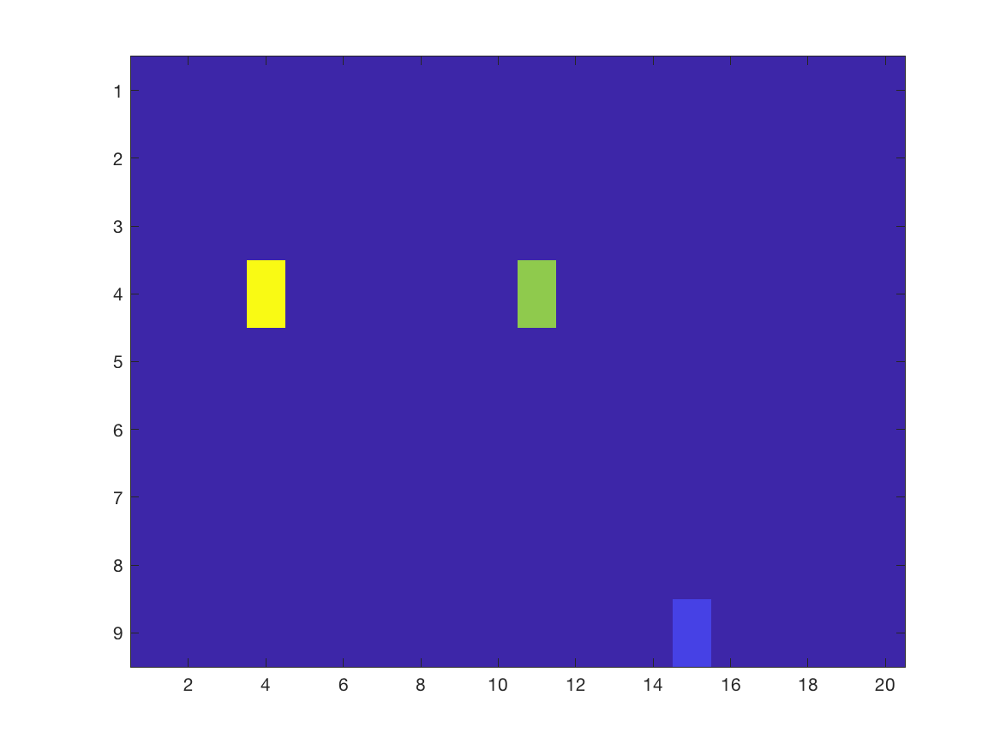
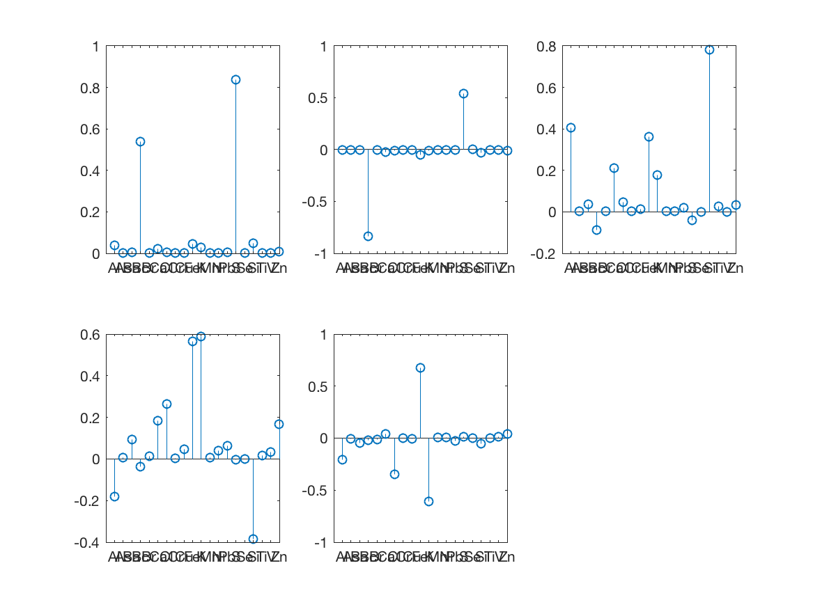
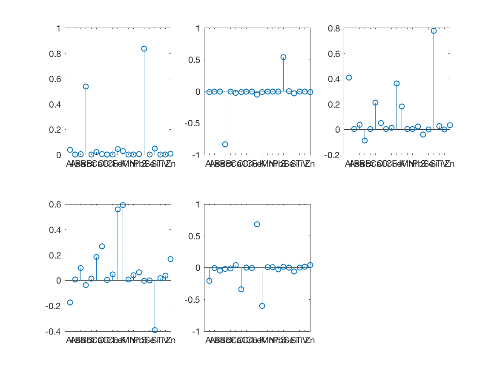
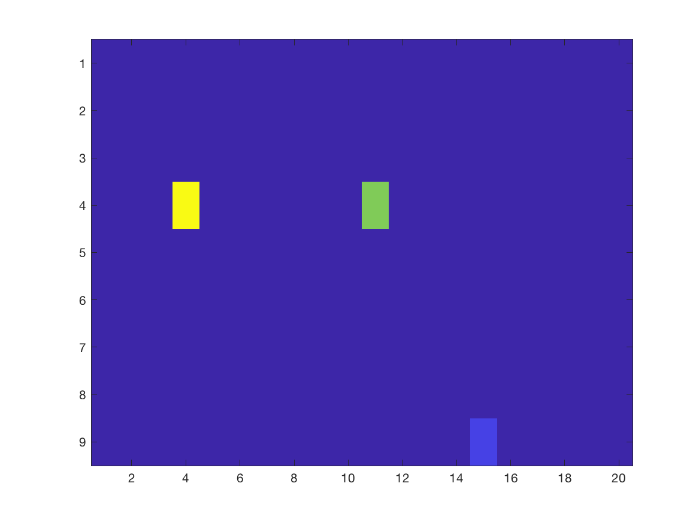
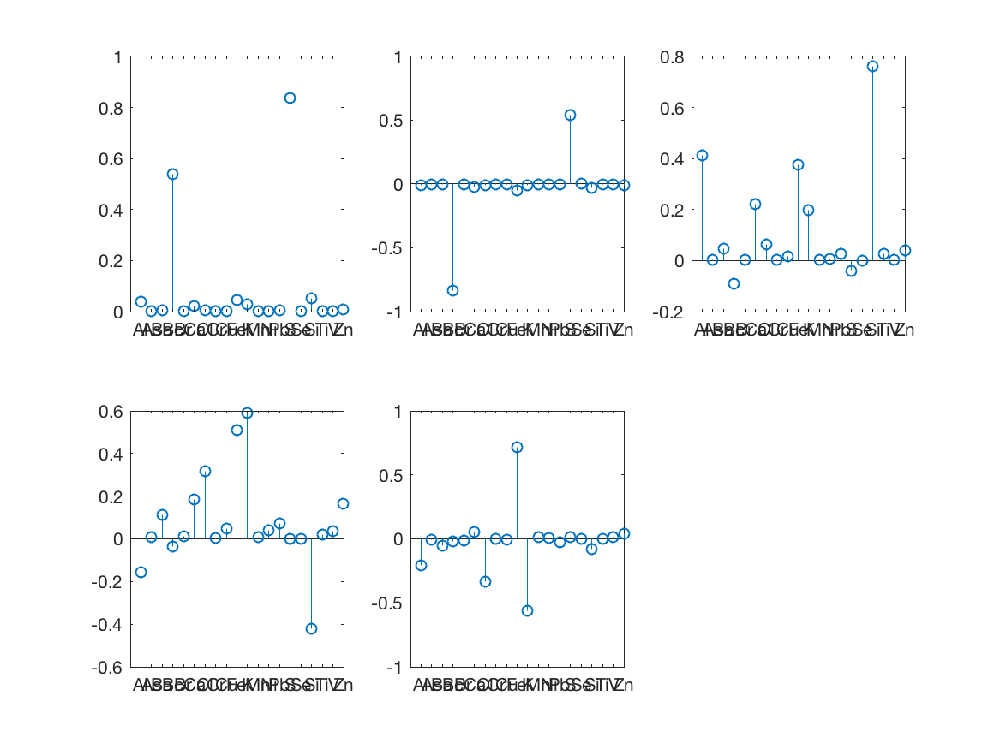
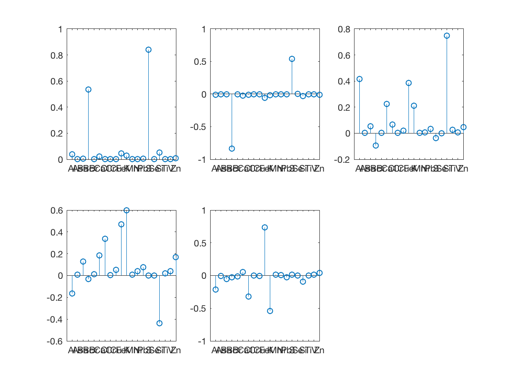
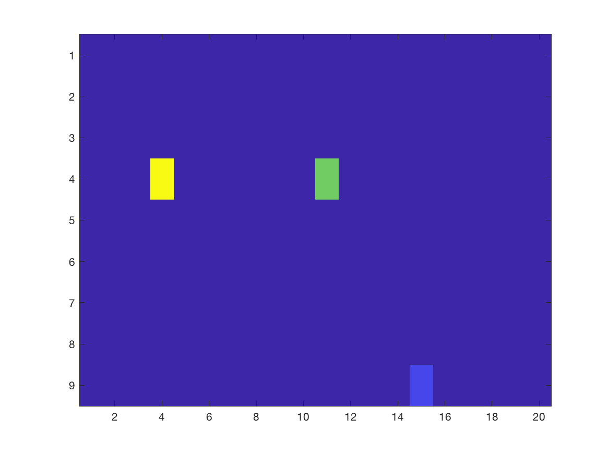

```{r setup, include=FALSE}
require("knitr")
opts_knit$set(root.dir = "../../")
opts_chunk$set(echo = TRUE)

library(R.matlab)
library(tidyverse)
```

## Data

* 20 air pollution species
* 2,478 days (~6.7 years)

```{r}
# Read air pollution data
mixture <- readMat("./Data/mixtures_data.mat")

mixture_data <- as.data.frame(mixture) %>% as_tibble() %>% 
  select(Al, As, Ba, bc, Br, Ca, Cl,
         Cr, Cu, Fe, K,  Mn,  Ni,  Pb,  S,  Se,  Si,
         Ti,  V, Zn) %>% 
  drop_na()

mixture_data
```

## Steps

1. Run Jingkai's PCP version on original air pollution data (MATLAB).
2. Artificially assign increasing LOD's (10%, 20%, 30%, 40%, and 50% <LOD) to separate test datasets (R).
3. Run Jingkai's PCP version on all 5 <LOD datasets, save L and S matrices from each (MATLAB).
4. Compare results from <LOD datasets with original (R).

## Create \<LOD Datasets

```{r}
# Create version with 10% lowest values for each variable as below the LOD
mix_data_lod_10 <- mixture_data %>% 
  mutate_all(~ifelse(. <= quantile(., probs = .10), -1, .))

#write_csv(as_tibble(mix_data_lod_10), "./Below_LOD/R/BLOD_airpol_data/mix_data_lod_10.csv")

# Create version with 20% lowest values for each variable as below the LOD
mix_data_lod_20 <- mixture_data %>% 
  mutate_all(~ifelse(. <= quantile(., probs = .20), -1, .))

#write_csv(as_tibble(mix_data_lod_20), "./Below_LOD/R/BLOD_airpol_data/mix_data_lod_20.csv")

# Create version with 30% lowest values for each variable as below the LOD
mix_data_lod_30 <- mixture_data %>% 
  mutate_all(~ifelse(. <= quantile(., probs = .30), -1, .))

#write_csv(as_tibble(mix_data_lod_30), "./Below_LOD/R/BLOD_airpol_data/mix_data_lod_30.csv")

# Create version with 40% lowest values for each variable as below the LOD
mix_data_lod_40 <- mixture_data %>% 
  mutate_all(~ifelse(. <= quantile(., probs = .40), -1, .))

#write_csv(as_tibble(mix_data_lod_40), "./Below_LOD/R/BLOD_airpol_data/mix_data_lod_40.csv")

# Create version with 50% lowest values for each variable as below the LOD
mix_data_lod_50 <- mixture_data %>% 
  mutate_all(~ifelse(. <= quantile(., probs = .50), -1, .))

summary(mix_data_lod_50)
#write_csv(as_tibble(mix_data_lod_50), "./Below_LOD/R/BLOD_airpol_data/mix_data_lod_50.csv")
```

## Read MATLAB Output

Ran PCP on separate datasets in MATLAB, load results L and S matrices from file.

*Low Rank Matrices*
```{r}
L_lod0 <- readMat("./Below_LOD/MATLAB/LOD_demo_output/lowrank_lod0.mat") %>% as.data.frame() %>% as_tibble() %>% as.matrix()
L_lod10 <- readMat("./Below_LOD/MATLAB/LOD_demo_output/lowrank_lod10.mat") %>% as.data.frame() %>% as_tibble() %>% as.matrix()
L_lod20 <- readMat("./Below_LOD/MATLAB/LOD_demo_output/lowrank_lod20.mat") %>% as.data.frame() %>% as_tibble() %>% as.matrix()
L_lod30 <- readMat("./Below_LOD/MATLAB/LOD_demo_output/lowrank_lod30.mat") %>% as.data.frame() %>% as_tibble() %>% as.matrix()
L_lod40 <- readMat("./Below_LOD/MATLAB/LOD_demo_output/lowrank_lod40.mat") %>% as.data.frame() %>% as_tibble() %>% as.matrix()
L_lod50 <- readMat("./Below_LOD/MATLAB/LOD_demo_output/lowrank_lod50.mat") %>% as.data.frame() %>% as_tibble() %>% as.matrix()
```

*Sparse Matrices*
```{r}
S_lod0 <- readMat("./Below_LOD/MATLAB/LOD_demo_output/sparse_lod0.mat") %>% as.data.frame() %>% as_tibble() %>% as.matrix()
S_lod10 <- readMat("./Below_LOD/MATLAB/LOD_demo_output/sparse_lod10.mat") %>% as.data.frame() %>% as_tibble() %>% as.matrix()
S_lod20 <- readMat("./Below_LOD/MATLAB/LOD_demo_output/sparse_lod20.mat") %>% as.data.frame() %>% as_tibble() %>% as.matrix()
S_lod30 <- readMat("./Below_LOD/MATLAB/LOD_demo_output/sparse_lod30.mat") %>% as.data.frame() %>% as_tibble() %>% as.matrix()
S_lod40 <- readMat("./Below_LOD/MATLAB/LOD_demo_output/sparse_lod40.mat") %>% as.data.frame() %>% as_tibble() %>% as.matrix()
S_lod50 <- readMat("./Below_LOD/MATLAB/LOD_demo_output/sparse_lod50.mat") %>% as.data.frame() %>% as_tibble() %>% as.matrix()
```

## Compare Results

### Visualize

**No values \<LOD**

<p float="left">
  
   
</p>

**10\% values \<LOD**

<p float="left">
  
   
</p>

**20\% values \<LOD**

<p float="left">
  
   
</p>

**30\% values \<LOD**

<p float="left">
  
   
</p>

**40\% values \<LOD**

<p float="left">
  
   
</p>

**50\% values \<LOD**

<p float="left">
  
   
</p>

### X - L - S

```{r}
X <- as.matrix(mixture_data)
F_norm <- as_data_frame(cbind(lod0 =norm((X - L_lod0 - S_lod0), type = "F")^2,
      lod10 =norm((X - L_lod10 - S_lod10), type = "F")^2,
      lod20 =norm((X - L_lod20 - S_lod20), type = "F")^2,
      lod30 =norm((X - L_lod30 - S_lod30), type = "F")^2,
      lod40 =norm((X - L_lod40 - S_lod40), type = "F")^2,
      lod50 =norm((X - L_lod50 - S_lod50), type = "F")^2)) %>% 
  gather(percent, norm)

F_norm %>% ggplot(aes(x = percent, y = norm)) + geom_point() + geom_path(aes(group = 1)) + theme_bw()
```

### \% L - 0\% L

```{r}
L_diff <- as_data_frame(cbind(lod0 =norm((L_lod0 - L_lod0), type = "F")^2,
      lod10 =norm((L_lod10 - L_lod0), type = "F")^2,
      lod20 =norm((L_lod20 - L_lod0), type = "F")^2,
      lod30 =norm((L_lod30 - L_lod0), type = "F")^2,
      lod40 =norm((L_lod40 - L_lod0), type = "F")^2,
      lod50 =norm((L_lod50 - L_lod0), type = "F")^2)) %>% 
  gather(percent, norm)

L_diff %>% ggplot(aes(x = percent, y = norm)) + geom_point() + geom_path(aes(group = 1)) + theme_bw()
```

### \% S - 0\% S

```{r}
S_diff <- as_data_frame(cbind(lod0 =norm((S_lod0 - S_lod0), type = "F")^2,
      lod10 =norm((S_lod10 - S_lod0), type = "F")^2,
      lod20 =norm((S_lod20 - S_lod0), type = "F")^2,
      lod30 =norm((S_lod30 - S_lod0), type = "F")^2,
      lod40 =norm((S_lod40 - S_lod0), type = "F")^2,
      lod50 =norm((S_lod50 - S_lod0), type = "F")^2)) %>% 
  gather(percent, norm)

S_diff %>% ggplot(aes(x = percent, y = norm)) + geom_point() + geom_path(aes(group = 1)) + theme_bw()
```

